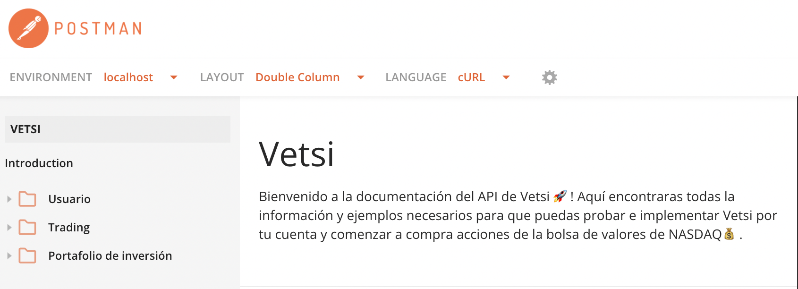
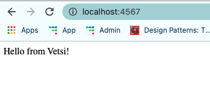
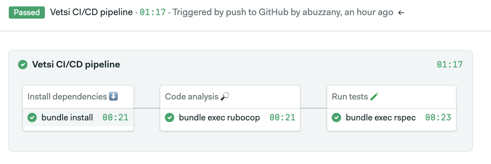

[](https://abuzzany.semaphoreci.com/projects/vetsi)
# Vetsi API 💰 🚀
```bash
____   ____      __         .__ 
\   \ /   /_____/  |_  _____|__|
 \   Y   // __ \   __\/  ___/  |
  \     /\  ___/|  |  \___ \|  |
   \___/  \___  >__| /____  >__|
              \/          \/    
```
Vetsi es un REST API con el que puedes hacer trading de acciones de la bolsa de balores NASDAQ.
## Pre-requisitos
Vetsi esta construido con Ruby 3.0.2, asegurate de tener instalada esta versión en tu entorno local. Si no sabes como isntalar Ruby te recomiendo hacerlo con rbenv, para eso sigue las siguientes instrucciones.

[Descargar e instalar ruby con Rbenv](https://github.com/rbenv/rbenv)

## Antes de comenzar
El proyecto tiene un Makefile para simplificar el uso de comando engorrosos y repetitivos, si quieres ver la lista de comandos y su documentación solo ejecuta:
```bash
$ make help

dkr-setup                      Build vetsi app on Docker.
dkr-start                      Start and lunch the vetsi on Docker.
dkr-test                       Run test suite (Rspec).
docs                           Generate documentation (Rdoc).
rubocop                        Run linter (Rubocop).
setup                          Install dependencies from Gemfile.
start                          Start web server locally.
test                           Run test suite (Rspec).
```
## Documentación
Vetsi cuenta con toda la documentción necesaria y ejemplos del uso del API en el siguiente link:

[Documentación en Postman](https://documenter.getpostman.com/view/18868814/UVRGDPWz)


También si así lo requieres el código esta documentado, y podras encontras el detalle del uso y funcionamiento de las clases dentro de
la carpeta `doc`.

## Instalación
Una vez que hayas instalado Ruby 3.0.2 ejecuta el siguiente comando para instalar el proyecto localmente:
```bash
$ make setup
```
## Guía de uso
Para que puedas probar el proyecto en tu local solo ejecuta el siguiente
comando:
```bash
$ make start
```
lo anterior arrancara un web server para que puedas hacer peticiones en la siguiente ruta:
```
http://localhost:4567
```
## Docker
Y porque estamos en el 2022 y nadie lo pidió, también puedes ejecutar el proyecto 
sobre [Docker](https://www.docker.com/), solo asegurate de tenerlo instalado,
sino sabes cómo, lo puedes hacer desde la siguiente liga:

[Descargar e instalar Docker](https://docs.docker.com/get-docker/)

Una vez instalado docker ejecuta los siguientes comando para construir la imagen
y luego lanzar el contenedor que contendrá el proyecto:

```bash
$ make dkr-setup
$ make dkr-start
```

Si el proyecto arranco de manera correcta, deberas de ver el siguiente mensaje en tu navegador:


## CI/CD
El pipeline de Continuous integration y Continuous delivery (CI/CD) del proyecto corre sobre SemaphoreCI. El pipeline de CI contempla 4 fases:
<ol>
<li>Install dependencies</li>
<li>Code analysis</li>
<li>Run tests</li>
</ol>



El deploy se hace en Heroku por medio de semaphore.

## Tests
El testing se hace con [Rspec](https://rspec.info/), si quieres ejecutar la suite de pruebas solo ejecuta el siguiente comando:
```bash
$ make test
```
o si esta ejecutando Vetsi sobre Docker ejecuta:
```bash
$ make dkr-test
```
## Linter
Para salva guardar las buenas practicas, guias de estilo y evitar code smell este proyecto hace uso de `Rubocop`, sono necesitas ejecutar el siguiente comando:
```bash
$ make rubocop
```
## Live Demo
Vetsi esta hosteado en Heroku en la ruta:
```bash
https://vetsi.herokuapp.com
```
Dentro de la documentación de postmane encontraras en environment de `production` para que puedas realizar pruebas sobre producción.

## Licencia

Capculator is open-sourced software licensed under the [MIT license](https://opensource.org/licenses/MIT).